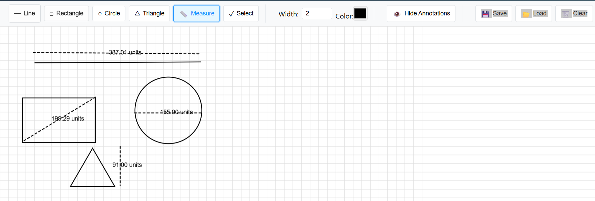
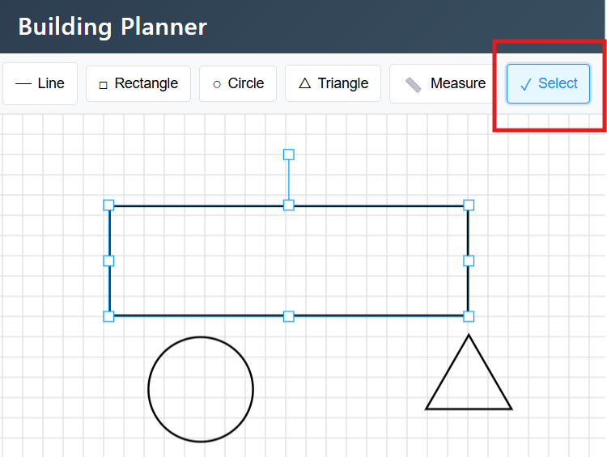
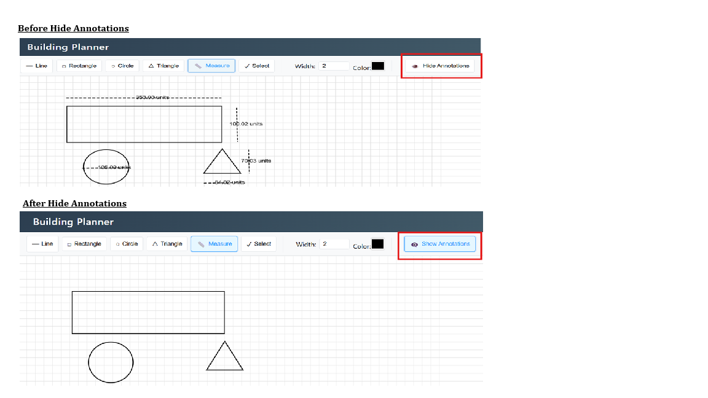

# Building Planner


A professional web application for creating, editing, and annotating building plans. Building Planner provides an intuitive interface with powerful drawing tools for architects, designers, and construction professionals to create detailed building plans with precise measurements and annotations.

## 🌟 Features

### Drawing Tools
- **Line Tool**: Create straight lines for walls, boundaries, and connections
- **Rectangle Tool**: Draw rectangular shapes for rooms, furniture, and structures
- **Circle Tool**: Add circular elements like columns, tables, or design features
- **Triangle Tool**: Create triangular shapes for roofs, decorative elements, or custom structures

### Measurement & Annotation
- **Measurement Tool**: Add dimension annotations with automatic measurements
- **Annotation Visibility**: Toggle visibility of all measurements and annotations
- **Custom Styling**: Adjust color and thickness of annotation lines

### Selection & Manipulation
- **Select Tool**: Click on any shape to select it
- **Move**: Drag selected shapes to reposition them
- **Resize**: Use transform handles to resize selected shapes
- **Transform**: Rotate and scale elements as needed

### Customization
- **Color Picker**: Choose from any color for your drawing elements
- **Stroke Width**: Adjust line thickness for different elements
- **Grid Background**: Precise drawing with grid alignment

### Project Management
- **Save**: Store your current drawing in local storage
- **Load**: Retrieve previously saved drawings
- **Clear Canvas**: Reset the drawing area when starting a new project

## 🚀 Getting Started

### Prerequisites

- Node.js (v14 or higher)
- npm or yarn package manager

### Installation

1. Clone the repository
   ```bash
   git clone https://github.com/yourusername/building-planner.git
   cd building-planner
   ```

2. Install dependencies
   ```bash
   npm install
   # or
   yarn install
   ```

3. Start the development server
   ```bash
   npm start
   # or
   yarn start
   ```

4. Open your browser and navigate to `http://localhost:3000`

## 💻 Usage Guide

### Basic Drawing

1. **Select a Tool**: Click on any drawing tool from the toolbar (Line, Rectangle, Circle, Triangle)
2. **Start Drawing**: Click and drag on the canvas to create your shape
3. **Customize**: Use the color picker and stroke width controls to adjust appearance

### Working with Annotations

1. **Add Measurements**: Select the Measure tool and click-drag between points
2. **Toggle Visibility**: Use the Show/Hide Annotations button to control visibility

### Managing Shapes

1. **Select**: Click the Select tool, then click on any shape
2. **Transform**: Use the handles to resize or rotate the selected shape
3. **Move**: Drag the selected shape to a new position

### Saving Your Work

1. **Save**: Click the Save button to store your current drawing
2. **Load**: Click the Load button to retrieve your last saved drawing
3. **Clear**: Use the Clear button to reset the canvas

## 🛠️ Technologies Used

- **React.js** - Frontend framework for building the user interface
- **Konva.js** - Canvas library for drawing and manipulating shapes
- **React-Konva** - React integration for Konva.js
- **LocalStorage API** - For saving and loading drawings

## 📋 Project Structure

```
building-planner/
├── public/                # Public assets
├── src/                   # Source files
│   ├── components/        # React components
│   │   ├── Header.js      # Application header
│   │   ├── Header.css     # Header styles
│   │   └── Toolbar.js     # Drawing toolbar
│   ├── App.js             # Main application component
│   ├── App.css            # Application styles
│   ├── index.js           # Entry point
│   └── index.css          # Global styles
├── package.json           # Dependencies and scripts
└── README.md              # Project documentation
```

## 🔄 Future Enhancements

- Export drawings as PNG, SVG, or PDF
- User accounts and cloud storage for drawings
- Collaborative editing features
- Predefined templates for common building layouts
- Layer management for complex drawings
- Snap-to-grid functionality for precise placement
- Undo/redo functionality

## 📝 License

This project is licensed under the MIT License - see the LICENSE file for details.

## 👥 Contributors

- Snehit - Initial work and development

## 📸 Implementation Screenshots

### Header and Toolbar
The application features a modern, gradient-styled header with an intuitive toolbar containing drawing tools and controls.


*Screenshot shows the application header with logo and the toolbar with drawing tools.*

### Drawing Canvas
The main drawing area provides a grid background for precise drawing and supports various shapes and annotations.


*Screenshot shows the drawing canvas with sample shapes and measurements.*

### Shape Selection and Transformation
Users can select shapes and transform them using the built-in handles.


*Screenshot demonstrates selecting and transforming a rectangle shape.*

### Annotation Tools
The measurement tool allows adding dimension annotations to the drawing.


*Screenshot shows dimension annotations on a sample floor plan.*

> **Note:** To add actual screenshots, create a `screenshots` folder in the project root and add your images with the filenames referenced above.

## 🙏 Acknowledgments

- [React](https://reactjs.org/) - JavaScript library for building user interfaces
- [Konva.js](https://konvajs.org/) - HTML5 Canvas JavaScript framework
- [React-Konva](https://github.com/konvajs/react-konva) - React binding to canvas element via Konva